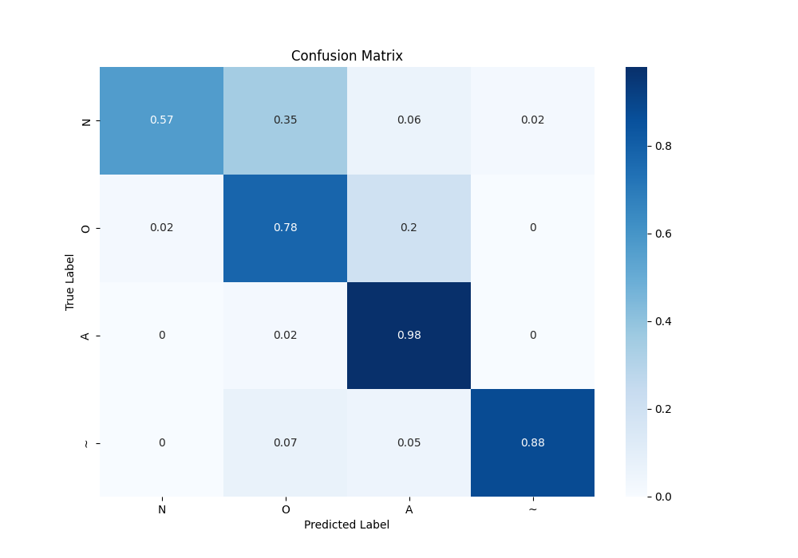

# AIMLab Challenge

## Pretrained Model
[Icentia11k_pretrained.pt](https://drive.google.com/file/d/1w1cn35Bp4l0npwcwhBzmhfYT31z-Hjk_/view?usp=sharing)

## Finetuned Model
[best_finetune_model_150.pt](https://drive.google.com/file/d/11VEO5d0DXBCJVuAqkMRfwLtrV6t5fWiE/view?usp=sharing)

## Confusion Matrix

## Classification Report
| Class | Precision | Recall | F1-Score | Support |
|-------|-----------|--------|----------|---------|
| N     | 0.83      | 0.57   | 0.67     | 51      |
| O     | 0.55      | 0.75   | 0.63     | 40      |
| A     | 0.84      | 0.93   | 0.88     | 45      |
| ~     | 0.97      | 0.88   | 0.93     | 42      |
|       |           |        |          |         |
| Accuracy |       |        | 0.78     | 178     |
| Macro Avg | 0.80 | 0.78   | 0.78     | 178     |
| Weighted Avg | 0.80 | 0.78 | 0.78 | 178 |

